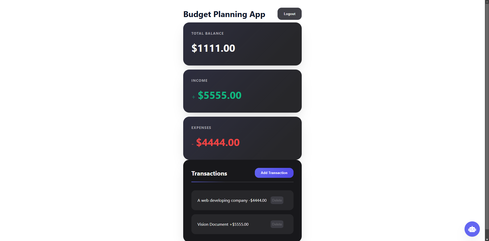

📊 Budget Planner App


📝 Overview

Budget Planner is a powerful and intuitive web application designed to help users efficiently manage their finances. It enables users to track income, expenses, and savings while offering insightful visualizations to analyze spending habits. Built with vanilla JavaScript, HTML, and CSS, the app integrates Firebase Realtime Database for seamless data storage and synchronization.

🚀 Live Demo

Check out the live demo [here](https://astronil.github.io/Budget-Planner/index.html).

🎯 Features

📌 Add, edit, and delete transactions with ease.

📊 Categorize expenses & income for better tracking.

📈 Visualize financial data with interactive charts.

🔄 Sync & store data securely using Firebase Realtime Database.

📱 Fully responsive design for seamless use on any device.

🛠️ Technologies Used

Frontend: HTML, CSS, JavaScript

Backend: Firebase Realtime Database

Deployment: GitHub Pages

CI/CD: GitHub Actions

📂 Project Setup

Follow these steps to set up and run the project locally:

1️⃣ Clone the repository

```bash
git clone https://github.com/Astronil/Budget-Planner.git

```

2️⃣ Navigate to the project folder and then install dependencies

```bash
cd cd budget-planner
npm install

```

3️⃣ Open index.html

Simply open the index.html file in your browser, or use a live server extension in VS Code for better development experience.

4️⃣ Firebase Setup (Optional)

To connect the app to Firebase Cloud Firestore:

Create a Firebase project at Firebase Console

Add a Cloud Firestore Database and configure its rules

Replace the Firebase configuration in the JavaScript file with your project details

💡 How to Contribute

Interested in improving the Budget Planner? Feel free to submit issues or contribute by creating pull requests. Let's build a better financial tool together! 🚀

💡 Don't forget to update the GitHub Pages link, repository link, and image once your site is live! 🎉

Made with by [Anil Poudel]
